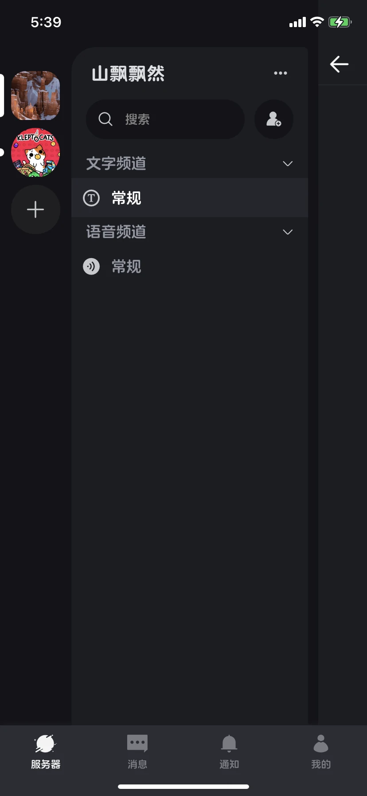
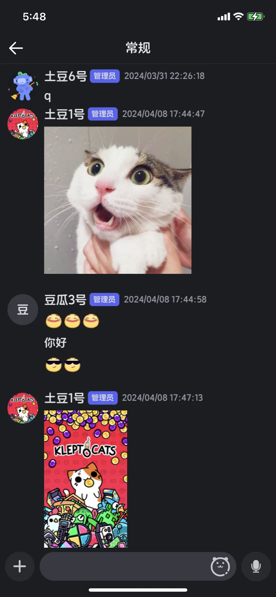
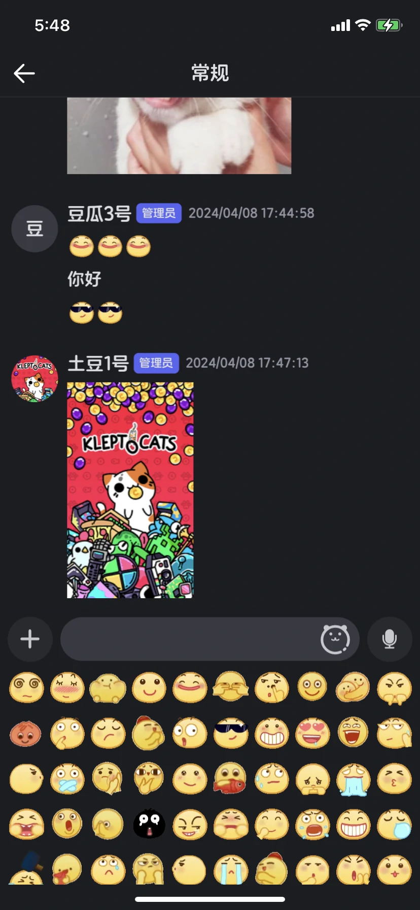
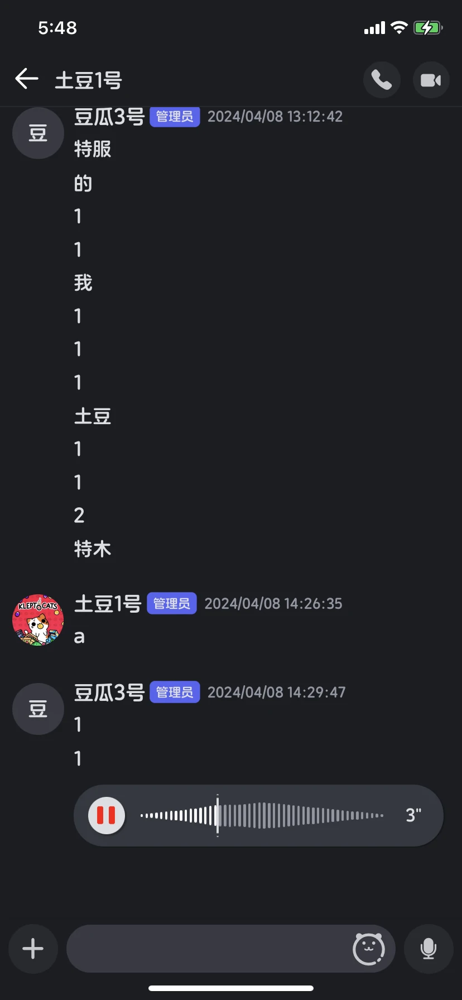
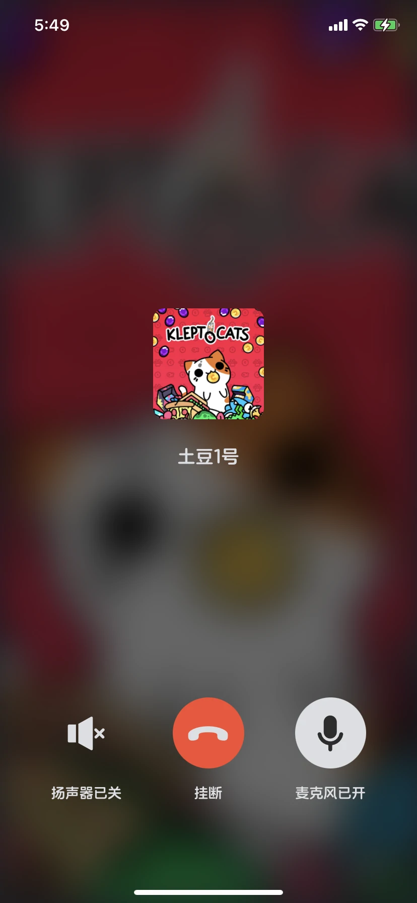
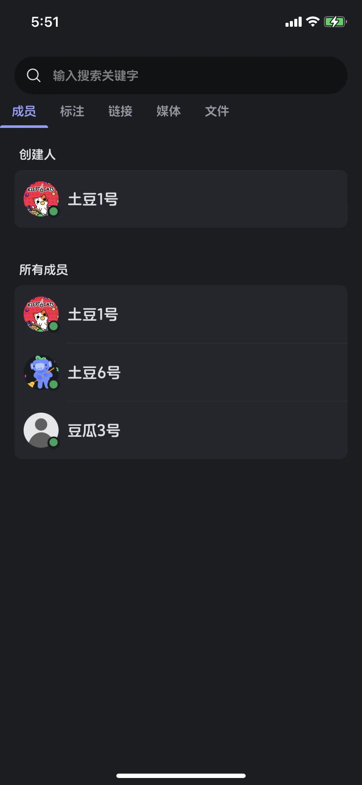
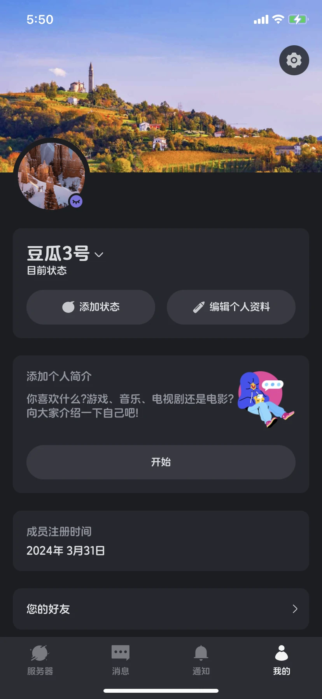

# Uniapp Chat

基于Uniapp，仿discord的聊天APP

# 预览效果：
&nbsp;&nbsp;&nbsp;&nbsp;&nbsp;&nbsp;
&nbsp;&nbsp;&nbsp;&nbsp;&nbsp;&nbsp;
&nbsp;&nbsp;&nbsp;&nbsp;&nbsp;&nbsp;
&nbsp;&nbsp;&nbsp;&nbsp;&nbsp;&nbsp;

## 前端Uniapp，后端nodejs+express+socketio

### 实现的功能模块：

注册，jwt登录校验  
聊天服务器创建/删除，服务器邀请，部分功能配置模块  
聊天室群聊，私聊，语音单聊  
聊天支持发送文字，图片，动态表情，语音  
邀请通知，聊天信息通知，系统信息通知  
个人信息页展示，个性化配置等  

### 支持

支持APP，H5，微信小程序